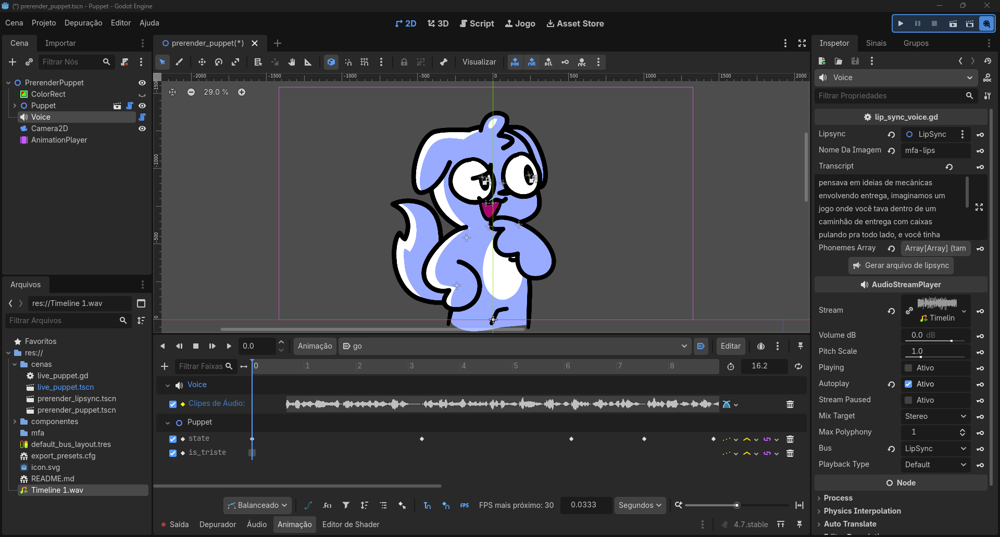

# FupiPuppet!!

Olá, esse é o projeto que eu uso para animar o meu avatar para os meus vídeos, shorts e livestreams! Sinta-se livre pra mudar os sprites, o código, o que você quiser, e usar nos seus próprios vídeos!



Esse projeto tem 3 jeitos de usar:

1. [Ao vivo -- para livestreams](#ao-vivo)
2. [Lip sync -- para criar uma boca animada que você pode colocar em cima de outras coisas](#lip-sync)
3. [Avatar completo -- para criar um avatar animado com lip sync e poses diferentes, pronto para usar em vídeos](#avatar-completo)

## Requisitos

Para rodar esse projeto, você vai precisar do [Godot Engine](https://godotengine.org/). Eu criei ele na versão 4.7.stable, mas imagino que qualquer versão 4.X vai funcionar. Esse é o único requisito para usar o avatar ao vivo.

Para renderizar vídeos usando lipsync ou o avatar completo, você vai precisar do FFMPEG. No Windows, recomendo instalar usando o [WinGet](https://winget.run/pkg/Gyan/FFmpeg).

Para usar o gerador de lip sync, você também precisa ter o [Docker Desktop](https://www.docker.com/products/docker-desktop/) instalado. Depois de instalar, você vai precisar compilar uma imagem. Execute o Docker Desktop, abra a pasta do projeto em um terminal, e execute o comando a seguir:

```sh
docker build -t mfa-lips ./mfa
```

Se compilar sem erros, está tudo pronto para usar todas as funções do avatar!

## Ao vivo

Neste modo, o programa te mostra uma janela transparente com o seu avatar, e quando você fala, ele abre a boca. Você também tem um painel ao lado para mudar a pose do seu personagem. Para integrar isso com o OBS, é só colocar essa janela como fonte de captura.

1. Abra a cena `cenas/live_puppet.tscn`;
2. Clique no nó "LivePuppet" para configurar, no inspetor:
    1. Qual microfone o avatar deve usar (clique no botão "Quais são meus microfones?" para ver uma lista de dispositivos na aba de Saída);
    2. Qual o volume mínimo que o avatar deve detectar antes de abrir a boca. Se o seu microfone tiver ruído, coloque um valor maior.
3. Pra obter melhores resultados, você pode usar redução de ruído e compressão no OBS, monitorar a saída usando um cabo de áudio virtual, e colocar esse cabo virtual como o microfone usado pelo avatar.

## Lip sync

Neste modo, você coloca um áudio + transcrição, e o programa gera a animação dos lábios automaticamente para combinar com a sua fala. Então, você pode sobrepor o vídeo gerado em outros vídeos ou imagens usando um editor de vídeo.

1. Abra a cena `cenas/prerender_lipsync.tscn`;
2. Clique no nó "Voice" para configurar, no inspetor:
    1. A transcrição ("Transcript") do seu áudio. É muito importante colar aqui o texto completo do que o seu áudio diz, sem erros de digitação;
    2. O seu áudio ("Stream"). Deve ser em formato WAV. Arraste o seu áudio para dentro da janela do Godot para importar o arquivo, e então arraste o arquivo de dentro do sistema de arquivos do Godot para o campo "Stream" do nó "Voice".
    3. Para gerar a sincronização de lábios, execute o Docker Desktop e clique no botão "Gerar arquivo de lipsync". Pra isso funcionar, os dois campos acima devem estar preenchidos. Essa operação leva vários minutos, enquanto isso o programa vai travar, é só esperar;
    4. Depois, abra o nó "AnimationPlayer" na aba Animação, abra a animação "go", e remova o clipe de áudio que está ali e troque pelo seu, arrastando o arquivo de áudio na timeline. Se a animação não for longa o suficiente para o áudio, pode estender ela. Essa animação representa o que será renderizado. Recomendo deixar 1 segundo de silêncio no início para que a boca atinja um estado neutro;
3. Se quiser renderizar uma animação de boca triste, clique no nó "LipSync" e marque a opção "Is Triste" no inspetor;
4. Dê play na cena (F6) para ver se a sincronização ficou como você queria;
5. Para renderizar os frames, clique no rolo de filme no canto superior direito para ativar o Modo Gravação, e execute a cena novamente, então espere;
6. Quando terminar, seus frames estarão na pasta `outputs`. Execute o arquivo `_png2mov.bat` (Windows) ou `_png2mov.sh` (Linux/Mac) para transformar seus frames em um vídeo! O vídeo gerado é um MOV transparente, que pode ser usado diretamente pelo DaVinci Resolve e outros programas de edição.

## Avatar completo

Neste modo, além de gerar a animação da boca do personagem, você também pode ir mudando as poses dele no decorrer da animação.

1. Abra a cena `cenas/prerender_puppet.tscn`;
2. Clique no nó "Voice" para configurar o lip sync. Siga os sub-itens da instrução 2 da [seção acima](#lip-sync) para ver como configurar;
3. Ainda na aba Animação, na animação "go", você pode ir criando quadros-chave para as propriedades "state" para mudar as poses, e "is_triste" para mudar pra uma boca feliz ou triste.
3. Dê play na cena (F6) para ver se a animação ficou como você queria;
4. Para renderizar os frames, clique no rolo de filme no canto superior direito para ativar o Modo Gravação, e execute a cena novamente, então espere;
5. Quando terminar, seus frames estarão na pasta `outputs`. Execute o arquivo `_png2mov.bat` (Windows) ou `_png2mov.sh` (Linux/Mac) para transformar seus frames em um vídeo! O vídeo gerado é um MOV transparente, que pode ser usado diretamente pelo DaVinci Resolve e outros programas de edição.

## Quero customizar com o meu personagem

Eu disponibilizei um personagem padrão, o Fupipuppy, que você já pode usar nos seus vídeos se quiser. Porém, acredito que alguma hora você vai querer tentar usar o seu próprio personagem.

O jeito mais fácil de fazer isso é só alterar os PNGs na pasta `componentes/puppet`. Porém, se fizer isso, você precisa garantir que os seus novos sprites têm exatamente o mesmo tamanho, senão vai ficar tudo desalinhado. Como esse projeto foi criado para o meu personagem especificamente, isso pode te limitar bastante, tipo se o seu personagem tiver cabelo grande, etc. Mas se você não tiver medo de mexer no Godot mais a fundo, você pode abrir a cena `componentes/puppet/puppet.tscn` e tentar fazer as alterações necessárias lá. Mover os sprites de lugar, ajustar as keyframes das poses... com um pouquinho de trabalho você consegue modificar o que você quiser.

Se você está movendo partes do corpo do personagem para tentar alinhar as suas novas imagens, e quando você salva o projeto elas voltam pra onde estavam, significa que tem alguma animação em algum nó AnimationPlayer que faz o movimento daquela parte. Então você tem 2 alternativas: ou você edita cada uma das animações necessárias com a nova posição dos seus sprites, ou você pode tentar adicionar um nó Node2D como pai do Sprite2D da parte do corpo que você quer mover, e aí mover esse Node2D ao invés de mudar a posição do próprio nó Sprite2D.

As bocas são salvas em formato de spritesheet (grave erro), então se você for alterar o arquivo `componentes/bocas.png`, precisa tomar cuidado pra que as suas novas bocas se encaixem exatamente no mesmo espaço que as bocas atuais. Isso até eu decidir trocar as bocas pra serem sprites separados assim como o corpo.

Se quiser criar mais uma pose para o seu personagem, é só abrir a cena `componentes/puppet/puppet.tscn`, adicionar uma nova animação ao node "Anims", e adicionar uma entrada com o mesmo nome no enum "State" no script do nó "Puppet", com o mesmo nome da animação que você criou, só que em maiúsculo. Cada parte do corpo também tem várias poses para que você possa reutilizar em várias poses diferentes, e se você quiser criar novas poses para elas é o mesmo processo, cada parte do corpo tem um "AnimationPlayer" com as poses, e um script com um enum de "States".

Resumindo, esse projeto não é super fácil de customizar, mas se você quiser tentar e precisar de ajuda é só me chamar.

## Créditos

Projeto feito por [Fupicat](https://fupi.cat), licença [Unlicense](LICENSE), você pode usar esse projeto, os vídeos gerados por ele, e todos os assets dele como quiser e não precisa me dar créditos.
